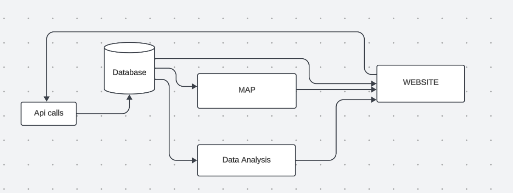
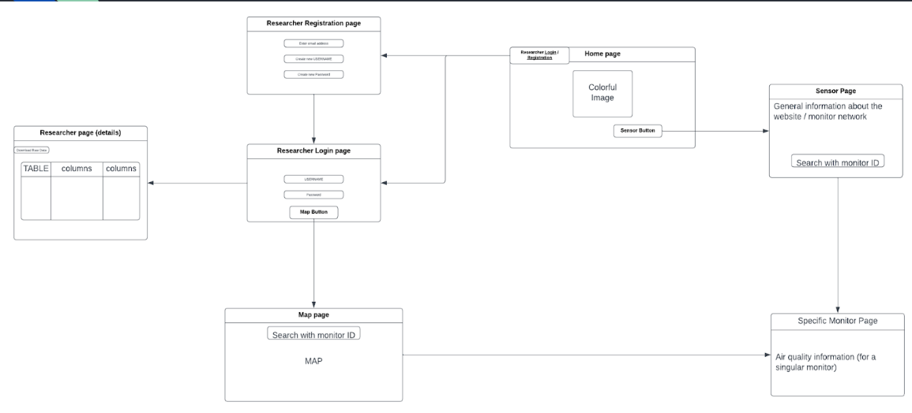
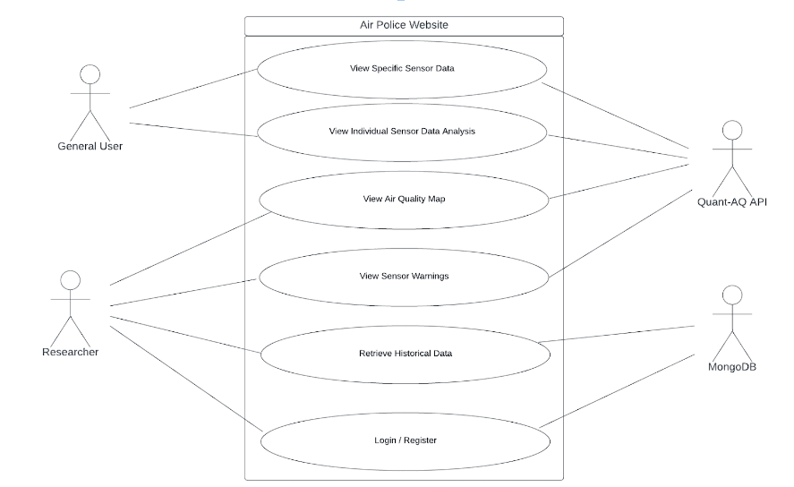

# Project Description
  Over the years, the Salton Sea in Riverside has shrunk, exposing a bed of toxic waste and pesticide-runoff to the atmosphere. As it dries, toxic dust is blown with the wind so researchers and nearby residents wish to monitor the local air quality. 

  Our goal for this project is to improve ease of access of air quality information provided by sensors in the Salton Sea area. We aim to make it easier to read data from the Quant-AQ API and provide an alert system for the status of air monitors.

  Our project is important because it will help residents better understand their local air quality, and find out if their air filters are effective or not. Our project will also provide tools to researchers so that they are to do their jobs more efficiently.
 
  We will rely on pre-existing air quality monitors installed in various residences around the Salton Sea for real-time data collection. Python serves as our primary tool to process and evaluate the data. Additionally, we are using MongoDB for easy retrieval of data.
  We are constructing the website with Handlebars (HTML), CSS, and node.js (javascript).
# System Architecture

# Wire Frame

# Use Case


# Dependencies
* Node.js - https://nodejs.org
  ```
  pip install folium
  ```
  ```
  pip install python-dotenv
  ```
  ```
  pip install requests
  ```
  ```
  pip install pandas
  ```
  ```
  pip install pymongo
  ```
  
# Install node js
* Please have node js installed to compile our project. Instructions to install node js are on this website: https://nodejs.org

# Install MySQL
* Please have mysql installed to compile our project. Instructions to install mysql are on this website: https://dev.mysql.com/downloads/installer/

# Set up .env
* create a .env file to the main directory and add
  ```
  c_URI = ""
  api_key =""
  DataBase_URL =
  mysqlhost = "localhost"
  mysqlUser = ""
  mysqlPort = 3306
  mysqlPassword = ""
    
  ```
  Make sure c_URI and DataBase_URL is your mongoDB api key
  and api_key is the quantaq, api_key
  
# How to access our local host website
* run ```npm ci```
* In order to access our http://localhost:3000 website, run
  ```npm start```
  on your machine. This redirects you to our website.


